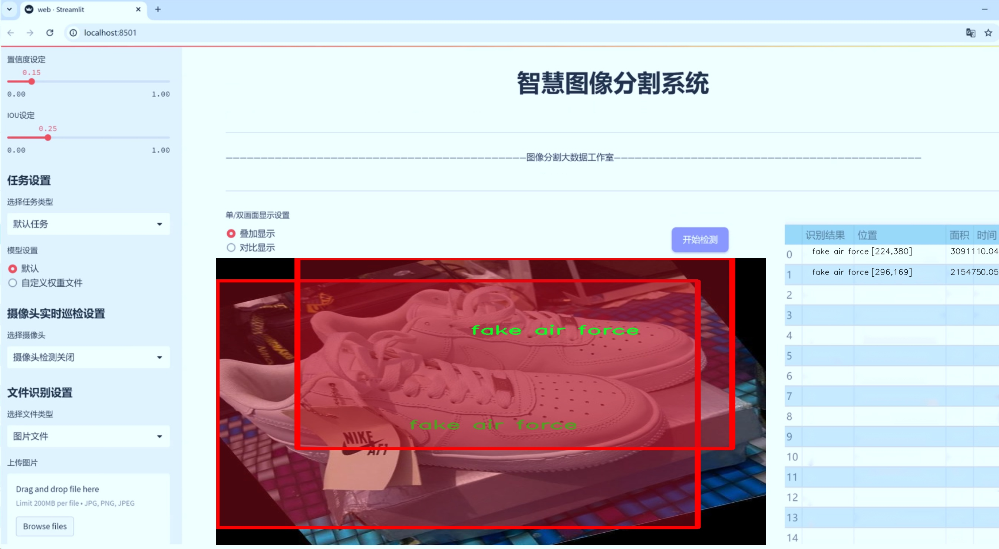
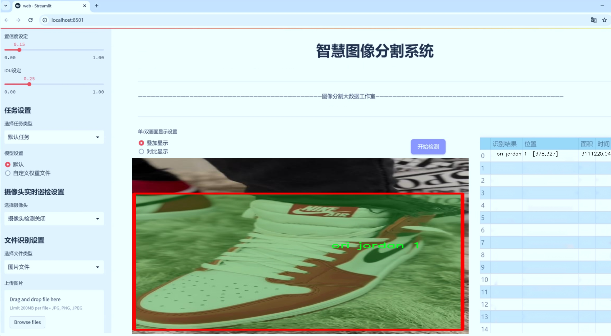
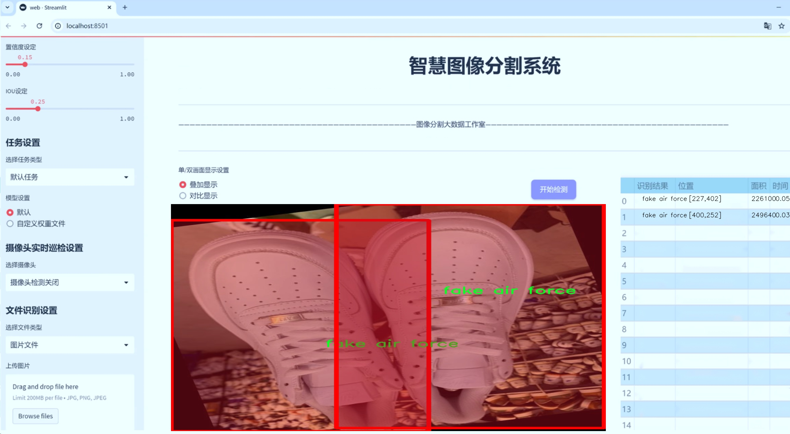
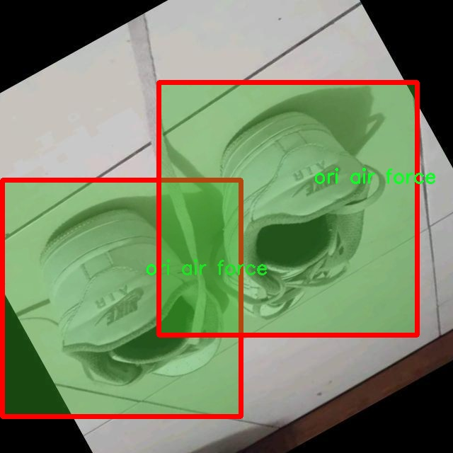
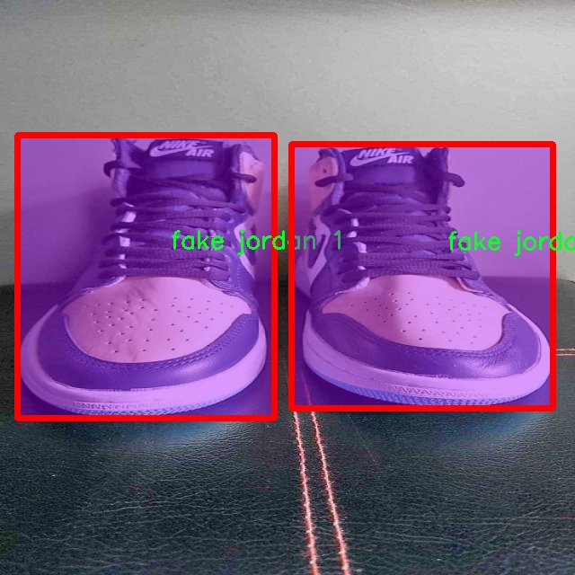
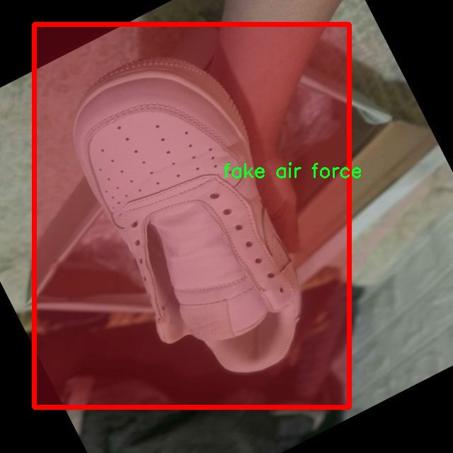
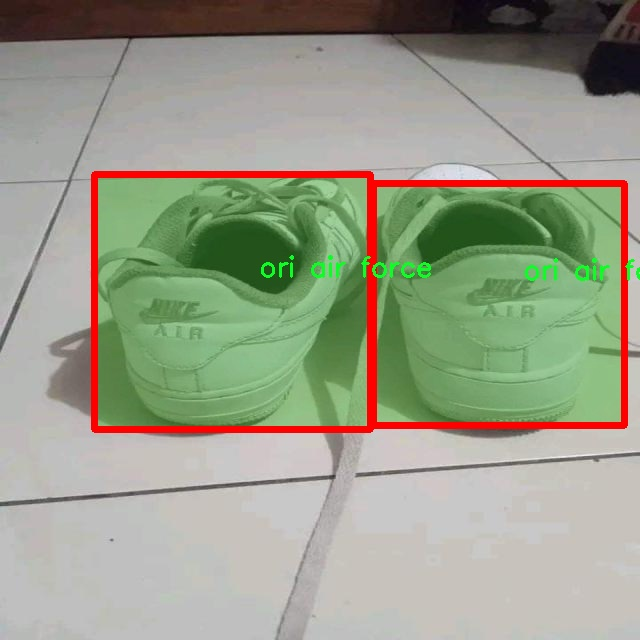
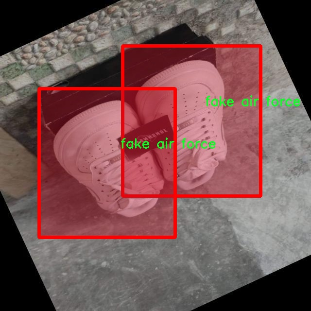

# 假鞋检测分割系统源码＆数据集分享
 [yolov8-seg-C2f-DiverseBranchBlock＆yolov8-seg-C2f-SCConv等50+全套改进创新点发刊_一键训练教程_Web前端展示]

### 1.研究背景与意义

项目参考[ILSVRC ImageNet Large Scale Visual Recognition Challenge](https://gitee.com/YOLOv8_YOLOv11_Segmentation_Studio/projects)

项目来源[AAAI Global Al lnnovation Contest](https://kdocs.cn/l/cszuIiCKVNis)

研究背景与意义

随着电子商务的迅猛发展，消费者在网上购物的便利性与日俱增。然而，随之而来的假冒伪劣商品问题也日益严重，尤其是在运动鞋市场中，假鞋的泛滥不仅损害了消费者的权益，也对品牌形象造成了极大的负面影响。根据市场调查，假鞋的销售额在近年来呈现出上升趋势，消费者在购买时往往难以辨别真伪，导致经济损失和信任危机。因此，开发一套高效、准确的假鞋检测系统显得尤为重要。

在众多的计算机视觉技术中，目标检测与分割技术近年来取得了显著进展，尤其是YOLO（You Only Look Once）系列模型因其高效性和实时性而受到广泛关注。YOLOv8作为该系列的最新版本，结合了深度学习和卷积神经网络的优势，能够在复杂的场景中实现快速而准确的目标检测。通过对YOLOv8的改进，能够进一步提升其在假鞋检测中的性能，尤其是在实例分割任务中，可以实现对假鞋与正品鞋的精确区分，从而为消费者提供更为可靠的购物体验。

本研究旨在基于改进的YOLOv8模型，构建一个假鞋检测分割系统。该系统将利用1700张图像数据集进行训练，数据集中包含8个类别，主要分为“假鞋”和“正品鞋”两大类。通过对数据集的深入分析与处理，我们将实现对不同类型假鞋的精准识别与分割。这不仅有助于提升模型的检测精度，也为后续的假鞋识别提供了丰富的样本基础。

在研究意义方面，首先，本项目的实施将为消费者提供一种有效的工具，帮助他们在购买运动鞋时能够更好地识别假冒产品，减少经济损失。其次，针对品牌商而言，假鞋检测系统的应用能够有效维护品牌形象，减少假冒产品对正品市场的冲击，促进品牌的可持续发展。此外，该系统的成功开发与应用，将为相关领域的研究提供重要的参考，推动计算机视觉技术在实际应用中的进一步发展。

综上所述，基于改进YOLOv8的假鞋检测分割系统不仅具有重要的现实意义，也为未来的研究提供了新的思路与方向。通过本研究，我们期望能够在假鞋检测领域取得突破，为消费者、品牌商及相关研究者提供更为有效的解决方案。

### 2.图片演示







##### 注意：由于此博客编辑较早，上面“2.图片演示”和“3.视频演示”展示的系统图片或者视频可能为老版本，新版本在老版本的基础上升级如下：（实际效果以升级的新版本为准）

  （1）适配了YOLOV8的“目标检测”模型和“实例分割”模型，通过加载相应的权重（.pt）文件即可自适应加载模型。

  （2）支持“图片识别”、“视频识别”、“摄像头实时识别”三种识别模式。

  （3）支持“图片识别”、“视频识别”、“摄像头实时识别”三种识别结果保存导出，解决手动导出（容易卡顿出现爆内存）存在的问题，识别完自动保存结果并导出到tempDir中。

  （4）支持Web前端系统中的标题、背景图等自定义修改，后面提供修改教程。

  另外本项目提供训练的数据集和训练教程,暂不提供权重文件（best.pt）,需要您按照教程进行训练后实现图片演示和Web前端界面演示的效果。

### 3.视频演示

[3.1 视频演示](https://www.bilibili.com/video/BV1qH2nYGEyL/)

### 4.数据集信息展示

##### 4.1 本项目数据集详细数据（类别数＆类别名）

nc: 4
names: ['fake air force', 'fake jordan 1', 'ori air force', 'ori jordan 1']


##### 4.2 本项目数据集信息介绍

数据集信息展示

在当今快速发展的时尚产业中，假冒商品的泛滥已成为一个严重的问题，尤其是在运动鞋市场。为了应对这一挑战，我们构建了一个名为“Fake Shoe Detection”的数据集，旨在为改进YOLOv8-seg的假鞋检测分割系统提供强有力的支持。该数据集专注于四个主要类别的运动鞋，这些类别不仅代表了市场上最常见的假鞋类型，也涵盖了正品鞋的经典款式。具体而言，数据集中包含的类别有：假冒的Air Force、假冒的Jordan 1、正品的Air Force以及正品的Jordan 1。

数据集的设计初衷是为了提高模型在假鞋检测中的准确性和鲁棒性。通过对这四个类别的深入分析，我们能够为模型提供丰富的样本，确保其在实际应用中能够有效地区分真假鞋款。每个类别都包含了大量的图像数据，这些图像在不同的光照条件、拍摄角度和背景下进行采集，以增强模型的泛化能力。假鞋和正品鞋的图像不仅在外观上存在差异，且在细节处理上也有所不同，因此我们特别注重图像的多样性，以便模型能够学习到更为细致的特征。

在数据集的构建过程中，我们严格遵循了数据标注的标准化流程。每一张图像都经过专业的标注团队进行标注，确保每个类别的鞋款都被准确地识别和分类。这一过程不仅提高了数据集的质量，也为后续的模型训练奠定了坚实的基础。通过对数据集的细致分析，我们发现，假鞋往往在材料、缝合工艺和品牌标识等方面存在明显的差异，这些特征将成为模型学习的重要依据。

此外，为了提升模型的性能，我们还考虑了数据集的平衡性。在构建数据集时，我们确保每个类别的样本数量相对均衡，以避免模型在训练过程中出现偏倚现象。通过这样的设计，我们希望模型能够在所有类别上都表现出色，而不仅仅是对某一特定类别的过拟合。

在数据集的使用过程中，我们鼓励研究人员和开发者对其进行进一步的扩展和优化。随着假鞋市场的不断变化，新的假冒鞋款层出不穷，因此我们也计划定期更新数据集，添加新的样本和类别，以保持其时效性和实用性。通过不断丰富数据集的内容，我们希望能够推动假鞋检测技术的发展，提升消费者的购物体验，减少假冒商品对品牌和市场的负面影响。

总之，“Fake Shoe Detection”数据集不仅是一个用于训练YOLOv8-seg模型的工具，更是一个为打击假冒商品提供技术支持的重要资源。我们相信，通过这一数据集的有效应用，能够为运动鞋市场的健康发展贡献一份力量。











### 5.全套项目环境部署视频教程（零基础手把手教学）

[5.1 环境部署教程链接（零基础手把手教学）](https://www.bilibili.com/video/BV1jG4Ve4E9t/?vd_source=bc9aec86d164b67a7004b996143742dc)


[5.2 安装Python虚拟环境创建和依赖库安装视频教程链接（零基础手把手教学）](https://www.bilibili.com/video/BV1nA4VeYEze/?vd_source=bc9aec86d164b67a7004b996143742dc)

### 6.手把手YOLOV8-seg训练视频教程（零基础小白有手就能学会）

[6.1 手把手YOLOV8-seg训练视频教程（零基础小白有手就能学会）](https://www.bilibili.com/video/BV1cA4VeYETe/?vd_source=bc9aec86d164b67a7004b996143742dc)


按照上面的训练视频教程链接加载项目提供的数据集，运行train.py即可开始训练



     Epoch   gpu_mem       box       obj       cls    labels  img_size
     1/200     0G   0.01576   0.01955  0.007536        22      1280: 100%|██████████| 849/849 [14:42<00:00,  1.04s/it]
               Class     Images     Labels          P          R     mAP@.5 mAP@.5:.95: 100%|██████████| 213/213 [01:14<00:00,  2.87it/s]
                 all       3395      17314      0.994      0.957      0.0957      0.0843

     Epoch   gpu_mem       box       obj       cls    labels  img_size
     2/200     0G   0.01578   0.01923  0.007006        22      1280: 100%|██████████| 849/849 [14:44<00:00,  1.04s/it]
               Class     Images     Labels          P          R     mAP@.5 mAP@.5:.95: 100%|██████████| 213/213 [01:12<00:00,  2.95it/s]
                 all       3395      17314      0.996      0.956      0.0957      0.0845

     Epoch   gpu_mem       box       obj       cls    labels  img_size
     3/200     0G   0.01561    0.0191  0.006895        27      1280: 100%|██████████| 849/849 [10:56<00:00,  1.29it/s]
               Class     Images     Labels          P          R     mAP@.5 mAP@.5:.95: 100%|███████   | 187/213 [00:52<00:00,  4.04it/s]
                 all       3395      17314      0.996      0.957      0.0957      0.0845


### 7.50+种全套YOLOV8-seg创新点代码加载调参视频教程（一键加载写好的改进模型的配置文件）

[7.1 50+种全套YOLOV8-seg创新点代码加载调参视频教程（一键加载写好的改进模型的配置文件）](https://www.bilibili.com/video/BV1Hw4VePEXv/?vd_source=bc9aec86d164b67a7004b996143742dc)

### 8.YOLOV8-seg图像分割算法原理

原始YOLOv8-seg算法原理

YOLOv8-seg算法是YOLO系列模型的最新版本，专注于目标检测与分割任务。相较于其前身YOLOv5，YOLOv8在多个方面进行了显著的优化和改进，旨在提高检测精度和推理速度，同时保持模型的轻量化特性。YOLOv8-seg不仅继承了YOLO系列模型的优良传统，还引入了新的架构设计和特征提取方法，使其在复杂场景下的表现更加出色。

首先，YOLOv8-seg的网络结构可以分为三个主要部分：Backbone、Neck和Head。Backbone部分负责特征提取，采用了一系列卷积和反卷积层，结合残差连接和瓶颈结构，旨在减小网络的大小并提高性能。在YOLOv8中，Backbone使用了C2F模块，替代了传统的C3模块，显著提升了特征提取的效率。C2F模块通过将卷积操作优化为3×3的卷积核，并在深度上进行了调整，使得模型在保持较小参数量的同时，能够提取到更加丰富的特征信息。

在特征融合阶段，YOLOv8-seg采用了多尺度特征融合技术，通过结合来自Backbone不同阶段的特征图，能够更好地捕捉不同尺度目标的信息。这一过程是通过Neck部分实现的，Neck结合了特征金字塔网络（FPN）和路径聚合网络（PAN），并引入了BiFPN网络，进一步提升了对不同尺度特征信息的提取速度。BiFPN的设计理念在于高效的双向跨尺度连接和加权特征融合，通过优化特征图的连接方式，使得信息流动更加顺畅，进而提高了模型的整体性能。

YOLOv8-seg的Head部分则负责最终的目标检测和分割任务。与传统的检测头不同，YOLOv8-seg使用了轻量化的解耦头，替代了耦合头。这一设计使得模型能够在处理目标检测时，更加灵活地应对有错目标的检测任务。解耦头的引入，使得模型在进行目标分类和定位时，能够独立处理每个任务，从而提升了检测的准确性和效率。

值得注意的是，YOLOv8-seg在训练和推理过程中，充分考虑了模型的轻量化特性。通过设置depth_factor、width_factor和ratio等参数，用户可以根据实际需求灵活调整模型的深度和宽度。这种灵活性使得YOLOv8-seg能够在不同的硬件环境下进行高效部署，满足各种应用场景的需求。

在模型的训练过程中，YOLOv8-seg引入了新的PyTorch训练和部署框架，使得自定义模型的训练变得更加方便。通过优化的训练策略和数据增强技术，YOLOv8-seg能够在较短的时间内实现较高的训练效果，进而提升模型的泛化能力和鲁棒性。

YOLOv8-seg的另一个显著特点是其原生支持自定义数据集的能力。用户可以根据具体的应用需求，轻松地将自己的数据集引入模型进行训练。这一特性不仅提高了模型的适用性，也为研究人员和开发者提供了更大的灵活性，能够在不同的领域和任务中发挥其强大的性能。

综上所述，YOLOv8-seg算法通过一系列创新的设计和优化，成功地提升了目标检测与分割的性能。其轻量化的网络结构、高效的特征提取与融合机制、灵活的模型设置以及对自定义数据集的支持，使得YOLOv8-seg成为当前目标检测领域中的一款强大工具。随着计算机视觉技术的不断发展，YOLOv8-seg无疑将在更广泛的应用场景中展现出其卓越的能力，推动目标检测与分割技术的进一步进步。


### 9.系统功能展示（检测对象为举例，实际内容以本项目数据集为准）

图9.1.系统支持检测结果表格显示

  图9.2.系统支持置信度和IOU阈值手动调节

  图9.3.系统支持自定义加载权重文件best.pt(需要你通过步骤5中训练获得)

  图9.4.系统支持摄像头实时识别

  图9.5.系统支持图片识别

  图9.6.系统支持视频识别

  图9.7.系统支持识别结果文件自动保存

  图9.8.系统支持Excel导出检测结果数据


### 10.50+种全套YOLOV8-seg创新点原理讲解（非科班也可以轻松写刊发刊，V11版本正在科研待更新）

#### 10.1 由于篇幅限制，每个创新点的具体原理讲解就不一一展开，具体见下列网址中的创新点对应子项目的技术原理博客网址【Blog】：


[10.1 50+种全套YOLOV8-seg创新点原理讲解链接](https://gitee.com/qunmasj/good)

#### 10.2 部分改进模块原理讲解(完整的改进原理见上图和技术博客链接)【此小节的图要是加载失败请移步原始博客查看，链接：https://blog.csdn.net/cheng2333333?type=blog】
### YOLOv8简介
#### Backbone


借鉴了其他算法的这些设计思想

借鉴了VGG的思想，使用了较多的3×3卷积，在每一次池化操作后，将通道数翻倍；

借鉴了network in network的思想，使用全局平均池化（global average pooling）做预测，并把1×1的卷积核置于3×3的卷积核之间，用来压缩特征；（我没找到这一步体现在哪里）

使用了批归一化层稳定模型训练，加速收敛，并且起到正则化作用。

    以上三点为Darknet19借鉴其他模型的点。Darknet53当然是在继承了Darknet19的这些优点的基础上再新增了下面这些优点的。因此列在了这里

借鉴了ResNet的思想，在网络中大量使用了残差连接，因此网络结构可以设计的很深，并且缓解了训练中梯度消失的问题，使得模型更容易收敛。

使用步长为2的卷积层代替池化层实现降采样。（这一点在经典的Darknet-53上是很明显的，output的长和宽从256降到128，再降低到64，一路降低到8，应该是通过步长为2的卷积层实现的；在YOLOv8的卷积层中也有体现，比如图中我标出的这些位置）

#### 特征融合

模型架构图如下

  Darknet-53的特点可以这样概括：（Conv卷积模块+Residual Block残差块）串行叠加4次

  Conv卷积层+Residual Block残差网络就被称为一个stage


上面红色指出的那个，原始的Darknet-53里面有一层 卷积，在YOLOv8里面，把一层卷积移除了

为什么移除呢？

        原始Darknet-53模型中间加的这个卷积层做了什么？滤波器（卷积核）的个数从 上一个卷积层的512个，先增加到1024个卷积核，然后下一层卷积的卷积核的个数又降低到512个

        移除掉这一层以后，少了1024个卷积核，就可以少做1024次卷积运算，同时也少了1024个3×3的卷积核的参数，也就是少了9×1024个参数需要拟合。这样可以大大减少了模型的参数，（相当于做了轻量化吧）

        移除掉这个卷积层，可能是因为作者发现移除掉这个卷积层以后，模型的score有所提升，所以才移除掉的。为什么移除掉以后，分数有所提高呢？可能是因为多了这些参数就容易，参数过多导致模型在训练集删过拟合，但是在测试集上表现很差，最终模型的分数比较低。你移除掉这个卷积层以后，参数减少了，过拟合现象不那么严重了，泛化能力增强了。当然这个是，拿着你做实验的结论，反过来再找补，再去强行解释这种现象的合理性。

过拟合


通过MMdetection官方绘制册这个图我们可以看到，进来的这张图片经过一个“Feature Pyramid Network(简称FPN)”，然后最后的P3、P4、P5传递给下一层的Neck和Head去做识别任务。 PAN（Path Aggregation Network）


“FPN是自顶向下，将高层的强语义特征传递下来。PAN就是在FPN的后面添加一个自底向上的金字塔，对FPN补充，将低层的强定位特征传递上去，

FPN是自顶（小尺寸，卷积次数多得到的结果，语义信息丰富）向下（大尺寸，卷积次数少得到的结果），将高层的强语义特征传递下来，对整个金字塔进行增强，不过只增强了语义信息，对定位信息没有传递。PAN就是针对这一点，在FPN的后面添加一个自底（卷积次数少，大尺寸）向上（卷积次数多，小尺寸，语义信息丰富）的金字塔，对FPN补充，将低层的强定位特征传递上去，又被称之为“双塔战术”。

FPN层自顶向下传达强语义特征，而特征金字塔则自底向上传达强定位特征，两两联手，从不同的主干层对不同的检测层进行参数聚合,这样的操作确实很皮。
#### 自底向上增强

而 PAN（Path Aggregation Network）是对 FPN 的一种改进，它的设计理念是在 FPN 后面添加一个自底向上的金字塔。PAN 引入了路径聚合的方式，通过将浅层特征图（低分辨率但语义信息较弱）和深层特征图（高分辨率但语义信息丰富）进行聚合，并沿着特定的路径传递特征信息，将低层的强定位特征传递上去。这样的操作能够进一步增强多尺度特征的表达能力，使得 PAN 在目标检测任务中表现更加优秀。


### 可重参化EfficientRepBiPAN优化Neck
#### Repvgg-style
Repvgg-style的卷积层包含
卷积+ReLU结构，该结构能够有效地利用硬件资源。

在训练时，Repvgg-style的卷积层包含
卷积、
卷积、identity。（下图左图）


在推理时，通过重参数化（re-parameterization），上述的多分支结构可以转换为单分支的
卷积。（下图右图）


基于上述思想，作者设计了对GPU硬件友好的EfficientRep Backbone和Rep-PAN Neck，将它们用于YOLOv6中。

EfficientRep Backbone的结构图：


Rep-PAN Neck结构图：


#### Multi-path
只使用repvgg-style不能达到很好的精度-速度平衡，对于大模型，作者探索了多路径的网络结构。

参考该博客提出了Bep unit，其结构如下图所示：


CSP（Cross Stage Partial）-style计算量小，且有丰富的梯度融合信息，广泛应用于YOLO系列中，比如YOLOv5、PPYOLOE。

作者将Bep unit与CSP-style结合，设计了一种新的网络结构BepC3，如下图所示：


基于BepC3模块，作者设计了新的CSPBep Backbone和CSPRepPAN Neck，以达到很好的精度-速度平衡。

其他YOLO系列在使用CSP-stype结构时，partial ratio设置为1/2。为了达到更好的性能，在YOLOv6m中partial ratio的值为2/3，在YOLOv6l中partial ratio的值为1/2。

对于YOLOv6m，单纯使用Rep-style结构和使用BepC3结构的对比如下图所示：

#### BIFPN
BiFPN 全称 Bidirectional Feature Pyramid Network 加权双向（自顶向下 + 自低向上）特征金字塔网络。

相比较于PANet，BiFPN在设计上的改变：

总结下图：
图d 蓝色部分为自顶向下的通路，传递的是高层特征的语义信息；红色部分是自底向上的通路，传递的是低层特征的位置信息；紫色部分是上述第二点提到的同一层在输入节点和输入节点间新加的一条边。


我们删除那些只有一条输入边的节点。这么做的思路很简单：如果一个节点只有一条输入边而没有特征融合，那么它对旨在融合不同特征的特征网络的贡献就会很小。删除它对我们的网络影响不大，同时简化了双向网络；如上图d 的 P7右边第一个节点

如果原始输入节点和输出节点处于同一层，我们会在原始输入节点和输出节点之间添加一条额外的边。思路：以在不增加太多成本的情况下融合更多的特性；

与只有一个自顶向下和一个自底向上路径的PANet不同，我们处理每个双向路径(自顶向下和自底而上)路径作为一个特征网络层，并重复同一层多次，以实现更高层次的特征融合。如下图EfficientNet 的网络结构所示，我们对BiFPN是重复使用多次的。而这个使用次数也不是我们认为设定的，而是作为参数一起加入网络的设计当中，使用NAS技术算出来的。


Weighted Feature Fusion 带权特征融合：学习不同输入特征的重要性，对不同输入特征有区分的融合。
设计思路：传统的特征融合往往只是简单的 feature map 叠加/相加 (sum them up)，比如使用concat或者shortcut连接，而不对同时加进来的 feature map 进行区分。然而，不同的输入 feature map 具有不同的分辨率，它们对融合输入 feature map 的贡献也是不同的，因此简单的对他们进行相加或叠加处理并不是最佳的操作。所以这里我们提出了一种简单而高效的加权特融合的机制。
常见的带权特征融合有三种方法，分别是：


​
  这种方法比较简单，直接加一个可学习的权重。但是由于这个权重不受限制，所有可能引起训练的不稳定，所有并不推荐。
Softmax-based fusion: O = ∑ i e w i ∗ I i ϵ + ∑ j e w j O = \sum_{i} \frac{e^{w_i} * I_i}{ \epsilon+\sum_{j}e^{w_j}}O=∑ 

 

​
  使用这种方法可以将范围放缩到 [ 0 , 1 ] [0, 1][0,1] 之间，训练稳定，但是训练很慢，所有也不推荐。
Fast normalized fusion: O = ∑ i w i ∗ I i ϵ + ∑ j w j O = \sum_{i} \frac{w_i * I_i}{ \epsilon+\sum_{j}w_j}O=∑ 


### 11.项目核心源码讲解（再也不用担心看不懂代码逻辑）

#### 11.1 ui.py

以下是经过精简和注释的核心代码部分：

```python
import sys
import subprocess

def run_script(script_path):
    """
    使用当前 Python 环境运行指定的脚本。

    Args:
        script_path (str): 要运行的脚本路径
    """
    # 获取当前 Python 解释器的路径
    python_path = sys.executable

    # 构建运行命令，使用 streamlit 运行指定的脚本
    command = f'"{python_path}" -m streamlit run "{script_path}"'

    # 执行命令并等待其完成
    result = subprocess.run(command, shell=True)
    
    # 检查命令执行结果，如果返回码不为0，表示出错
    if result.returncode != 0:
        print("脚本运行出错。")

# 主程序入口
if __name__ == "__main__":
    # 指定要运行的脚本路径
    script_path = "web.py"  # 这里可以直接使用相对路径

    # 调用函数运行脚本
    run_script(script_path)
```

### 代码说明：
1. **导入模块**：
   - `sys`：用于获取当前 Python 解释器的路径。
   - `subprocess`：用于执行外部命令。

2. **`run_script` 函数**：
   - 接收一个脚本路径作为参数。
   - 使用 `sys.executable` 获取当前 Python 解释器的路径。
   - 构建一个命令字符串，使用 `streamlit` 运行指定的脚本。
   - 使用 `subprocess.run` 执行该命令，并等待其完成。
   - 检查命令的返回码，如果不为0，则输出错误信息。

3. **主程序入口**：
   - 当脚本作为主程序运行时，指定要运行的脚本路径（此处为 `web.py`）。
   - 调用 `run_script` 函数来执行该脚本。

这个程序文件名为 `ui.py`，它的主要功能是通过当前的 Python 环境来运行一个指定的脚本，具体是使用 Streamlit 框架来启动一个 Web 应用。

首先，文件中导入了一些必要的模块，包括 `sys`、`os` 和 `subprocess`。其中，`sys` 模块用于访问与 Python 解释器相关的变量和函数，`os` 模块提供了与操作系统交互的功能，而 `subprocess` 模块则用于执行外部命令。

接下来，文件中定义了一个名为 `run_script` 的函数。这个函数接受一个参数 `script_path`，它是要运行的脚本的路径。函数内部首先获取当前 Python 解释器的路径，这通过 `sys.executable` 实现。然后，构建一个命令字符串，格式为 `"{python_path}" -m streamlit run "{script_path}"`，这个命令会调用 Streamlit 来运行指定的脚本。

随后，使用 `subprocess.run` 方法来执行这个命令，`shell=True` 参数允许在 shell 中执行命令。执行完命令后，函数会检查返回码，如果返回码不为 0，表示脚本运行出错，此时会打印出错误信息。

在文件的最后部分，使用 `if __name__ == "__main__":` 语句来确保只有在直接运行该文件时才会执行以下代码。这里指定了要运行的脚本路径为 `web.py`，并调用 `run_script` 函数来执行这个脚本。

总的来说，这个文件的作用是提供一个简单的接口来运行一个 Streamlit Web 应用，通过指定脚本路径，程序能够在当前 Python 环境中启动该应用。

#### 11.2 ultralytics\nn\extra_modules\ops_dcnv3\modules\dcnv3.py

以下是代码中最核心的部分，并附上详细的中文注释：

```python
import torch
from torch import nn
import torch.nn.functional as F

class DCNv3(nn.Module):
    def __init__(self,
                 channels=64,
                 kernel_size=3,
                 stride=1,
                 pad=1,
                 dilation=1,
                 group=4,
                 offset_scale=1.0,
                 center_feature_scale=False,
                 remove_center=False):
        """
        DCNv3模块的初始化函数
        :param channels: 输入通道数
        :param kernel_size: 卷积核大小
        :param stride: 步幅
        :param pad: 填充
        :param dilation: 膨胀
        :param group: 分组数
        :param offset_scale: 偏移缩放因子
        :param center_feature_scale: 是否使用中心特征缩放
        :param remove_center: 是否移除中心
        """
        super().__init__()
        # 检查通道数是否可以被分组数整除
        if channels % group != 0:
            raise ValueError(f'channels must be divisible by group, but got {channels} and {group}')
        
        self.channels = channels
        self.kernel_size = kernel_size
        self.stride = stride
        self.dilation = dilation
        self.pad = pad
        self.group = group
        self.group_channels = channels // group
        self.offset_scale = offset_scale
        self.center_feature_scale = center_feature_scale
        self.remove_center = int(remove_center)

        # 初始化卷积层、偏移量和掩码的线性层
        self.dw_conv = nn.Conv2d(channels, channels, kernel_size, stride=stride, padding=pad, groups=channels)
        self.offset = nn.Linear(channels, group * (kernel_size * kernel_size - remove_center) * 2)
        self.mask = nn.Linear(channels, group * (kernel_size * kernel_size - remove_center))
        self.input_proj = nn.Linear(channels, channels)
        self.output_proj = nn.Linear(channels, channels)
        self._reset_parameters()  # 重置参数

    def _reset_parameters(self):
        """重置模型参数"""
        nn.init.constant_(self.offset.weight.data, 0.)
        nn.init.constant_(self.offset.bias.data, 0.)
        nn.init.constant_(self.mask.weight.data, 0.)
        nn.init.constant_(self.mask.bias.data, 0.)
        nn.init.xavier_uniform_(self.input_proj.weight.data)
        nn.init.constant_(self.input_proj.bias.data, 0.)
        nn.init.xavier_uniform_(self.output_proj.weight.data)
        nn.init.constant_(self.output_proj.bias.data, 0.)

    def forward(self, input):
        """
        前向传播函数
        :param input: 输入张量，形状为 (N, H, W, C)
        :return: 输出张量，形状为 (N, H, W, C)
        """
        N, H, W, _ = input.shape  # 获取输入的形状

        x = self.input_proj(input)  # 投影输入
        x_proj = x  # 保存投影后的输入用于后续计算

        x1 = input.permute(0, 3, 1, 2)  # 将输入从 (N, H, W, C) 转换为 (N, C, H, W)
        x1 = self.dw_conv(x1)  # 深度卷积
        offset = self.offset(x1)  # 计算偏移量
        mask = self.mask(x1).reshape(N, H, W, self.group, -1)  # 计算掩码并调整形状
        mask = F.softmax(mask, -1)  # 对掩码进行softmax处理

        # 使用DCNv3的核心功能进行卷积操作
        x = DCNv3Function.apply(
            x, offset, mask,
            self.kernel_size, self.kernel_size,
            self.stride, self.stride,
            self.pad, self.pad,
            self.dilation, self.dilation,
            self.group, self.group_channels,
            self.offset_scale,
            256,
            self.remove_center)

        x = self.output_proj(x)  # 投影输出
        return x  # 返回输出
```

### 代码说明：
1. **DCNv3类**：实现了一个深度可分离卷积模块，主要用于特征提取。
2. **初始化函数**：设置卷积参数，检查通道数和分组数的关系，并初始化各个线性层。
3. **_reset_parameters函数**：用于初始化模型参数，确保偏移量和掩码的权重为零，其他权重使用Xavier均匀分布初始化。
4. **forward函数**：实现前向传播，输入数据经过投影、深度卷积、偏移量和掩码的计算，最终输出处理后的特征图。

这个程序文件定义了一个名为 `dcnv3.py` 的模块，主要用于实现深度学习中的 DCNv3（Deformable Convolutional Networks v3）功能。该模块包含多个类和函数，主要用于构建和操作 DCNv3 模块，适用于图像处理和计算机视觉任务。

首先，文件引入了一些必要的库，包括 PyTorch 的核心库和一些函数。接着，定义了两个类 `to_channels_first` 和 `to_channels_last`，它们分别用于在输入数据的通道格式之间进行转换。这种转换在处理不同格式的张量时非常有用，尤其是在使用卷积操作时。

接下来，`build_norm_layer` 函数用于构建归一化层，支持批归一化（Batch Normalization）和层归一化（Layer Normalization），并根据输入和输出格式进行通道转换。`build_act_layer` 函数则用于构建激活函数层，支持 ReLU、SiLU 和 GELU 激活函数。

`_is_power_of_2` 函数用于检查一个数字是否是 2 的幂，这在优化计算时非常重要。

`CenterFeatureScaleModule` 类实现了一个中心特征缩放模块，用于对输入进行线性变换并应用 Sigmoid 激活。

`DCNv3_pytorch` 类是 DCNv3 模块的核心实现，构造函数中定义了多个参数，包括通道数、卷积核大小、步幅、填充、扩张、分组数等。该类的 `forward` 方法实现了 DCNv3 的前向传播过程，首先对输入进行线性变换，然后通过深度卷积和偏移量计算得到输出特征图。

`DCNv3` 类是另一个实现，功能与 `DCNv3_pytorch` 类似，但使用了不同的卷积实现。它同样包含参数初始化和前向传播方法。

最后，`DCNv3_DyHead` 类是 DCNv3 的动态头实现，专注于处理动态卷积操作，包含与前述类相似的结构和功能。

整体而言，这个模块提供了灵活的接口来构建和使用 DCNv3 模块，支持多种配置和操作，适合用于各种深度学习任务，尤其是在需要处理复杂特征的计算机视觉应用中。

#### 11.3 ultralytics\nn\extra_modules\ops_dcnv3\modules\__init__.py

以下是保留的核心代码部分，并附上详细的中文注释：

```python
# 导入必要的模块
from .dcnv3 import DCNv3, DCNv3_pytorch, DCNv3_DyHead

# 以上代码从当前包的 dcnv3 模块中导入了三个类或函数：
# 1. DCNv3：可能是一个深度可分离卷积网络的实现。
# 2. DCNv3_pytorch：可能是基于 PyTorch 框架的 DCNv3 实现。
# 3. DCNv3_DyHead：可能是与动态头部相关的实现，通常用于目标检测等任务中。
```

这段代码的核心在于导入其他模块中的特定类或函数，以便在当前模块中使用它们。

这个程序文件是一个Python模块的初始化文件，位于`ultralytics/nn/extra_modules/ops_dcnv3/modules/`目录下。文件的开头包含了一些版权信息，表明该代码属于OpenGVLab，并且受MIT许可证的保护。这意味着用户可以自由使用、修改和分发该代码，只要遵循许可证的条款。

在文件的主体部分，使用了`from`语句导入了三个类或函数：`DCNv3`、`DCNv3_pytorch`和`DCNv3_DyHead`。这些导入的内容来自于同一目录下的`dcnv3`模块。通过这种方式，用户在导入这个模块时，可以直接使用这三个类或函数，而不需要单独去导入`dcnv3`模块。

总体来说，这个文件的主要作用是将特定的功能（如DCNv3相关的实现）暴露给外部使用者，简化了模块的使用流程。

#### 11.4 train.py

以下是代码中最核心的部分，并附上详细的中文注释：

```python
import os
import torch
import yaml
from ultralytics import YOLO  # 导入YOLO模型库

if __name__ == '__main__':  # 确保该模块被直接运行时才执行以下代码
    # 设置训练参数
    workers = 1  # 数据加载的工作进程数
    batch = 8  # 每个批次的样本数量，视显存情况调整
    device = "0" if torch.cuda.is_available() else "cpu"  # 判断是否使用GPU

    # 获取数据集配置文件的绝对路径
    data_path = abs_path(f'datasets/data/data.yaml', path_type='current')

    # 将路径格式转换为Unix风格
    unix_style_path = data_path.replace(os.sep, '/')
    # 获取数据集所在目录的路径
    directory_path = os.path.dirname(unix_style_path)

    # 读取YAML文件，保持原有顺序
    with open(data_path, 'r') as file:
        data = yaml.load(file, Loader=yaml.FullLoader)

    # 修改数据集路径
    if 'train' in data and 'val' in data and 'test' in data:
        data['train'] = directory_path + '/train'  # 更新训练集路径
        data['val'] = directory_path + '/val'      # 更新验证集路径
        data['test'] = directory_path + '/test'    # 更新测试集路径

        # 将修改后的数据写回YAML文件
        with open(data_path, 'w') as file:
            yaml.safe_dump(data, file, sort_keys=False)

    # 加载YOLO模型配置和预训练权重
    model = YOLO(r"C:\codeseg\codenew\50+种YOLOv8算法改进源码大全和调试加载训练教程（非必要）\改进YOLOv8模型配置文件\yolov8-seg-C2f-Faster.yaml").load("./weights/yolov8s-seg.pt")

    # 开始训练模型
    results = model.train(
        data=data_path,  # 指定训练数据的配置文件路径
        device=device,  # 指定使用的设备（GPU或CPU）
        workers=workers,  # 指定数据加载的工作进程数
        imgsz=640,  # 输入图像的大小为640x640
        epochs=100,  # 训练100个epoch
        batch=batch,  # 每个批次的样本数量
    )
```

### 代码核心部分说明：
1. **导入必要的库**：导入`os`、`torch`、`yaml`和YOLO模型库，准备进行模型训练。
2. **设置训练参数**：包括工作进程数、批次大小和设备选择（GPU或CPU）。
3. **数据集路径处理**：读取YAML配置文件，更新训练、验证和测试集的路径，并将修改后的内容写回文件。
4. **加载YOLO模型**：指定模型配置文件和预训练权重进行加载。
5. **模型训练**：调用`train`方法开始训练，传入必要的参数，如数据路径、设备、工作进程数、图像大小和训练轮数。

该程序文件`train.py`主要用于训练YOLO（You Only Look Once）模型，具体是YOLOv8版本的一个变体。程序首先导入了必要的库，包括操作系统库`os`、深度学习框架`torch`、YAML处理库`yaml`以及YOLO模型库`ultralytics`。同时，程序还导入了一个路径处理模块`abs_path`，并设置了Matplotlib的后端为'TkAgg'，以便于图形界面的显示。

在`__main__`块中，程序首先定义了一些训练参数。`workers`设置为1，表示使用一个工作进程来加载数据；`batch`设置为8，表示每个批次的样本数量；`device`根据是否有可用的GPU来选择训练设备，如果有GPU则使用GPU（标记为"0"），否则使用CPU。

接下来，程序通过`abs_path`函数获取数据集配置文件`data.yaml`的绝对路径，并将其转换为Unix风格的路径。然后，程序提取出该路径的目录部分，以便后续构建训练、验证和测试数据的路径。

程序打开YAML文件并读取其内容，使用`yaml.load`函数保持原有的顺序。接着，程序检查YAML文件中是否包含'train'、'val'和'test'这三个字段，如果存在，则将它们的路径修改为当前目录下的'train'、'val'和'test'子目录，并将修改后的数据写回到YAML文件中。

在模型加载部分，程序通过指定的配置文件路径加载YOLO模型。程序中给出了一个具体的配置文件路径`yolov8-seg-C2f-Faster.yaml`，并加载了预训练的权重文件`yolov8s-seg.pt`。值得注意的是，程序中提到不同模型的大小和设备要求可能不同，因此如果遇到显存不足的错误，可以尝试使用其他模型配置文件。

最后，程序调用`model.train`方法开始训练模型，传入了数据配置文件路径、设备、工作进程数量、输入图像大小（640x640）、训练的epoch数量（100）以及批次大小（8）等参数。通过这些设置，程序将会启动YOLO模型的训练过程。

#### 11.5 ultralytics\models\yolo\pose\predict.py

以下是经过简化和注释的核心代码部分：

```python
# 导入必要的模块和类
from ultralytics.engine.results import Results
from ultralytics.models.yolo.detect.predict import DetectionPredictor
from ultralytics.utils import DEFAULT_CFG, LOGGER, ops

class PosePredictor(DetectionPredictor):
    """
    PosePredictor类，继承自DetectionPredictor类，用于基于姿态模型的预测。
    """

    def __init__(self, cfg=DEFAULT_CFG, overrides=None, _callbacks=None):
        """初始化PosePredictor，设置任务为'pose'并记录使用'mps'作为设备的警告信息。"""
        super().__init__(cfg, overrides, _callbacks)  # 调用父类构造函数
        self.args.task = 'pose'  # 设置任务类型为姿态预测
        # 检查设备类型，如果是'mps'，则发出警告
        if isinstance(self.args.device, str) and self.args.device.lower() == 'mps':
            LOGGER.warning("WARNING ⚠️ Apple MPS known Pose bug. Recommend 'device=cpu' for Pose models. "
                           'See https://github.com/ultralytics/ultralytics/issues/4031.')

    def postprocess(self, preds, img, orig_imgs):
        """对给定输入图像或图像列表返回检测结果。"""
        # 应用非极大值抑制，过滤预测结果
        preds = ops.non_max_suppression(preds,
                                        self.args.conf,  # 置信度阈值
                                        self.args.iou,   # IOU阈值
                                        agnostic=self.args.agnostic_nms,  # 是否类别无关
                                        max_det=self.args.max_det,  # 最大检测数量
                                        classes=self.args.classes,  # 过滤的类别
                                        nc=len(self.model.names))  # 类别数量

        # 如果输入图像不是列表，则将其转换为numpy数组
        if not isinstance(orig_imgs, list):
            orig_imgs = ops.convert_torch2numpy_batch(orig_imgs)

        results = []  # 存储结果的列表
        for i, pred in enumerate(preds):  # 遍历每个预测结果
            orig_img = orig_imgs[i]  # 获取原始图像
            # 调整预测框的坐标到原始图像的大小
            pred[:, :4] = ops.scale_boxes(img.shape[2:], pred[:, :4], orig_img.shape).round()
            # 获取关键点预测并调整其坐标
            pred_kpts = pred[:, 6:].view(len(pred), *self.model.kpt_shape) if len(pred) else pred[:, 6:]
            pred_kpts = ops.scale_coords(img.shape[2:], pred_kpts, orig_img.shape)
            img_path = self.batch[0][i]  # 获取图像路径
            # 将结果存储到Results对象中
            results.append(
                Results(orig_img, path=img_path, names=self.model.names, boxes=pred[:, :6], keypoints=pred_kpts))
        return results  # 返回所有结果
```

### 代码说明：
1. **PosePredictor类**：该类用于进行姿态预测，继承自`DetectionPredictor`，主要负责初始化和后处理预测结果。
2. **`__init__`方法**：构造函数，设置任务类型为“pose”，并检查设备类型，如果是Apple的MPS设备，则发出警告。
3. **`postprocess`方法**：处理模型的输出结果，应用非极大值抑制来过滤检测框，并将预测框和关键点的坐标调整到原始图像的大小，最后将结果存储在`Results`对象中并返回。

这个程序文件是Ultralytics YOLO（You Only Look Once）模型的一部分，专门用于姿态预测。它继承了检测预测器（DetectionPredictor）类，扩展了其功能以支持姿态估计。

在文件的开头，首先导入了一些必要的模块和类，包括结果处理类（Results）、检测预测器（DetectionPredictor）以及一些工具函数（ops）。这些导入为后续的功能实现提供了基础。

PosePredictor类的构造函数`__init__`中，调用了父类的构造函数，并将任务类型设置为“pose”，即姿态估计。同时，如果设备被设置为“mps”（苹果的金属性能着色器），则会发出警告，提示用户在使用姿态模型时建议使用“cpu”设备。这是因为在某些情况下，使用“mps”可能会导致已知的错误。

`postprocess`方法用于处理模型的预测结果。它接收预测结果、输入图像和原始图像作为参数。首先，通过非极大值抑制（non-max suppression）来过滤掉低置信度的检测结果，确保保留最相关的检测框。接着，如果输入的原始图像不是列表格式（即是一个torch张量），则将其转换为numpy数组。

然后，程序遍历每个预测结果，获取对应的原始图像，并对预测框进行缩放，以适应原始图像的尺寸。关键点的预测结果也会进行相应的缩放处理。最后，将处理后的结果（包括原始图像、路径、模型名称、检测框和关键点）封装到Results对象中，并将所有结果存储在一个列表中返回。

总体来说，这个文件实现了一个姿态预测器，能够从输入图像中提取姿态信息，并对结果进行后处理，以便于后续的分析和使用。

#### 11.6 ultralytics\models\sam\amg.py

以下是代码中最核心的部分，并附上详细的中文注释：

```python
import torch

def is_box_near_crop_edge(boxes: torch.Tensor,
                          crop_box: List[int],
                          orig_box: List[int],
                          atol: float = 20.0) -> torch.Tensor:
    """
    判断给定的边界框是否接近裁剪边缘。

    参数：
    - boxes: 需要判断的边界框，格式为 (x1, y1, x2, y2) 的张量。
    - crop_box: 当前裁剪框的边界，格式为 [x0, y0, x1, y1]。
    - orig_box: 原始图像的边界框，格式为 [x0, y0, x1, y1]。
    - atol: 允许的绝对误差，默认为 20.0。

    返回：
    - 返回一个布尔张量，指示每个边界框是否接近裁剪边缘。
    """
    # 将裁剪框和原始框转换为张量
    crop_box_torch = torch.as_tensor(crop_box, dtype=torch.float, device=boxes.device)
    orig_box_torch = torch.as_tensor(orig_box, dtype=torch.float, device=boxes.device)
    
    # 将边界框从裁剪坐标转换为原始坐标
    boxes = uncrop_boxes_xyxy(boxes, crop_box).float()
    
    # 判断边界框是否接近裁剪框边缘
    near_crop_edge = torch.isclose(boxes, crop_box_torch[None, :], atol=atol, rtol=0)
    # 判断边界框是否接近原始图像边缘
    near_image_edge = torch.isclose(boxes, orig_box_torch[None, :], atol=atol, rtol=0)
    
    # 取两者的逻辑与，确保边界框不接近原始图像边缘
    near_crop_edge = torch.logical_and(near_crop_edge, ~near_image_edge)
    
    # 返回是否有任何边界框接近裁剪边缘
    return torch.any(near_crop_edge, dim=1)


def uncrop_boxes_xyxy(boxes: torch.Tensor, crop_box: List[int]) -> torch.Tensor:
    """
    将裁剪的边界框转换为原始图像坐标。

    参数：
    - boxes: 裁剪后的边界框，格式为 (x1, y1, x2, y2) 的张量。
    - crop_box: 当前裁剪框的边界，格式为 [x0, y0, x1, y1]。

    返回：
    - 返回转换后的边界框张量。
    """
    x0, y0, _, _ = crop_box
    # 创建偏移量张量
    offset = torch.tensor([[x0, y0, x0, y0]], device=boxes.device)
    
    # 检查 boxes 是否有通道维度
    if len(boxes.shape) == 3:
        offset = offset.unsqueeze(1)
    
    # 返回加上偏移量后的边界框
    return boxes + offset


def batched_mask_to_box(masks: torch.Tensor) -> torch.Tensor:
    """
    计算给定掩码的边界框，返回格式为 (x1, y1, x2, y2)。

    参数：
    - masks: 输入掩码，格式为 C1xC2x...xHxW。

    返回：
    - 返回每个掩码的边界框，格式为 C1xC2x...x4。
    """
    # 如果掩码为空，返回 [0, 0, 0, 0]
    if torch.numel(masks) == 0:
        return torch.zeros(*masks.shape[:-2], 4, device=masks.device)

    # 将掩码形状标准化为 CxHxW
    shape = masks.shape
    h, w = shape[-2:]
    masks = masks.flatten(0, -3) if len(shape) > 2 else masks.unsqueeze(0)
    
    # 获取掩码的上下边缘
    in_height, _ = torch.max(masks, dim=-1)
    in_height_coords = in_height * torch.arange(h, device=in_height.device)[None, :]
    bottom_edges, _ = torch.max(in_height_coords, dim=-1)
    in_height_coords = in_height_coords + h * (~in_height)
    top_edges, _ = torch.min(in_height_coords, dim=-1)

    # 获取掩码的左右边缘
    in_width, _ = torch.max(masks, dim=-2)
    in_width_coords = in_width * torch.arange(w, device=in_width.device)[None, :]
    right_edges, _ = torch.max(in_width_coords, dim=-1)
    in_width_coords = in_width_coords + w * (~in_width)
    left_edges, _ = torch.min(in_width_coords, dim=-1)

    # 如果掩码为空，右边缘会在左边缘的左侧，替换这些框为 [0, 0, 0, 0]
    empty_filter = (right_edges < left_edges) | (bottom_edges < top_edges)
    out = torch.stack([left_edges, top_edges, right_edges, bottom_edges], dim=-1)
    out = out * (~empty_filter).unsqueeze(-1)

    # 返回到原始形状
    return out.reshape(*shape[:-2], 4) if len(shape) > 2 else out[0]
```

### 代码核心部分解释：
1. **`is_box_near_crop_edge`**: 判断边界框是否接近裁剪框的边缘。通过将边界框从裁剪坐标转换为原始坐标，并与裁剪框和原始框进行比较，返回一个布尔张量。

2. **`uncrop_boxes_xyxy`**: 将裁剪后的边界框转换为原始图像坐标。通过添加裁剪框的偏移量来实现。

3. **`batched_mask_to_box`**: 从掩码中计算边界框。通过找到掩码的上下左右边缘，并处理空掩码的情况，返回每个掩码的边界框。

这个程序文件主要实现了一些与图像处理和掩膜相关的功能，特别是在目标检测和分割任务中。文件中包含多个函数，每个函数都有其特定的功能，以下是对这些函数的逐一说明。

首先，`is_box_near_crop_edge`函数用于判断给定的边界框是否接近裁剪边缘。它接收边界框、裁剪框和原始框的坐标，并通过比较来确定边界框是否接近裁剪边缘。该函数返回一个布尔张量，指示哪些边界框接近裁剪边缘。

接下来，`batch_iterator`函数用于从输入参数中生成批次数据。它确保所有输入的长度相同，并根据指定的批次大小返回数据的批次。

`calculate_stability_score`函数计算一组掩膜的稳定性分数。稳定性分数是通过对掩膜进行阈值处理得到的二进制掩膜之间的交并比（IoU）来计算的，反映了掩膜的稳定性。

`build_point_grid`函数生成一个二维网格，网格中的点均匀分布在[0,1]x[0,1]的范围内。这个函数对于后续的图像处理操作非常有用。

`build_all_layer_point_grids`函数生成所有裁剪层的点网格，考虑到每层的缩放比例。

`generate_crop_boxes`函数生成不同大小的裁剪框。它根据输入图像的大小、层数和重叠比例生成裁剪框，并返回这些框及其对应的层索引。

`uncrop_boxes_xyxy`和`uncrop_points`函数用于将裁剪的边界框和点进行反裁剪，恢复到原始图像的坐标系中。

`uncrop_masks`函数将裁剪的掩膜进行反裁剪，填充到原始图像的大小。

`remove_small_regions`函数用于去除掩膜中小的孤立区域或孔洞。它使用OpenCV库中的连通组件分析方法来识别和处理这些小区域。

`batched_mask_to_box`函数计算掩膜周围的边界框，返回格式为XYXY的边界框。它能够处理空掩膜的情况，并返回适当的结果。

总体而言，这个文件提供了一系列工具函数，旨在支持图像处理、目标检测和分割任务中的各种操作，尤其是在处理裁剪和掩膜时的需求。通过这些函数，用户可以更方便地进行图像的分析和处理。

### 12.系统整体结构（节选）

### 整体功能和构架概括

该项目主要是一个基于YOLO（You Only Look Once）模型的计算机视觉框架，旨在实现目标检测、姿态估计和图像分割等功能。项目结构清晰，包含多个模块，每个模块负责特定的功能。以下是对各个模块的功能和构架的概括：

- **模型训练与推理**：`train.py`负责模型的训练过程，使用YOLOv8模型进行目标检测。
- **姿态预测**：`predict.py`实现了姿态估计的功能，处理输入图像并输出关键点信息。
- **图像处理与掩膜操作**：`amg.py`提供了一系列图像处理函数，特别是与掩膜和裁剪相关的操作。
- **模块初始化**：`__init__.py`用于模块的初始化，简化了模块的导入过程。
- **用户界面**：`ui.py`提供了一个简单的用户界面，用于启动Streamlit应用。
- **其他辅助功能**：包括身份验证、数据验证等功能的实现。

### 文件功能整理表

| 文件路径                                              | 功能描述                                                 |
|-----------------------------------------------------|--------------------------------------------------------|
| `C:\codeseg\codenew\code\ui.py`                    | 提供用户界面，通过Streamlit启动Web应用。                   |
| `C:\codeseg\codenew\code\ultralytics\nn\extra_modules\ops_dcnv3\modules\dcnv3.py` | 实现DCNv3（Deformable Convolutional Networks v3）模块，支持深度学习中的卷积操作。 |
| `C:\codeseg\codenew\code\ultralytics\nn\extra_modules\ops_dcnv3\modules\__init__.py` | 初始化模块，导入DCNv3相关类，简化模块使用。                  |
| `C:\codeseg\codenew\code\train.py`                 | 负责YOLO模型的训练过程，配置数据集和训练参数。               |
| `C:\codeseg\codenew\code\ultralytics\models\yolo\pose\predict.py` | 实现姿态预测功能，处理输入图像并输出关键点信息。               |
| `C:\codeseg\codenew\code\ultralytics\models\sam\amg.py` | 提供图像处理和掩膜操作的工具函数，支持目标检测和分割任务。       |
| `C:\codeseg\codenew\code\ultralytics\models\sam\modules\sam.py` | 实现SAM（Segment Anything Model）相关功能，支持图像分割。      |
| `C:\codeseg\codenew\code\ultralytics\models\yolo\detect\val.py` | 实现YOLO模型的验证功能，评估模型在验证集上的表现。             |
| `C:\codeseg\codenew\code\ultralytics\models\nas\predict.py` | 实现神经架构搜索（NAS）相关的预测功能。                       |
| `C:\codeseg\codenew\code\ui_style.py`              | 定义用户界面的样式和布局，支持Streamlit应用的视觉效果。         |
| `C:\codeseg\codenew\code\ultralytics\solutions\ai_gym.py` | 提供AI训练和评估的环境，支持强化学习等任务。                   |
| `C:\codeseg\codenew\code\ultralytics\hub\auth.py` | 实现身份验证功能，支持用户认证和授权。                         |
| `C:\codeseg\codenew\code\ultralytics\engine\validator.py` | 提供数据验证功能，确保输入数据的质量和格式正确。               |

这个表格概述了项目中各个文件的功能，帮助理解项目的整体架构和各个模块之间的关系。

注意：由于此博客编辑较早，上面“11.项目核心源码讲解（再也不用担心看不懂代码逻辑）”中部分代码可能会优化升级，仅供参考学习，完整“训练源码”、“Web前端界面”和“50+种创新点源码”以“14.完整训练+Web前端界面+50+种创新点源码、数据集获取”的内容为准。

### 13.图片、视频、摄像头图像分割Demo(去除WebUI)代码

在这个博客小节中，我们将讨论如何在不使用WebUI的情况下，实现图像分割模型的使用。本项目代码已经优化整合，方便用户将分割功能嵌入自己的项目中。
核心功能包括图片、视频、摄像头图像的分割，ROI区域的轮廓提取、类别分类、周长计算、面积计算、圆度计算以及颜色提取等。
这些功能提供了良好的二次开发基础。

### 核心代码解读

以下是主要代码片段，我们会为每一块代码进行详细的批注解释：

```python
import random
import cv2
import numpy as np
from PIL import ImageFont, ImageDraw, Image
from hashlib import md5
from model import Web_Detector
from chinese_name_list import Label_list

# 根据名称生成颜色
def generate_color_based_on_name(name):
    ......

# 计算多边形面积
def calculate_polygon_area(points):
    return cv2.contourArea(points.astype(np.float32))

...
# 绘制中文标签
def draw_with_chinese(image, text, position, font_size=20, color=(255, 0, 0)):
    image_pil = Image.fromarray(cv2.cvtColor(image, cv2.COLOR_BGR2RGB))
    draw = ImageDraw.Draw(image_pil)
    font = ImageFont.truetype("simsun.ttc", font_size, encoding="unic")
    draw.text(position, text, font=font, fill=color)
    return cv2.cvtColor(np.array(image_pil), cv2.COLOR_RGB2BGR)

# 动态调整参数
def adjust_parameter(image_size, base_size=1000):
    max_size = max(image_size)
    return max_size / base_size

# 绘制检测结果
def draw_detections(image, info, alpha=0.2):
    name, bbox, conf, cls_id, mask = info['class_name'], info['bbox'], info['score'], info['class_id'], info['mask']
    adjust_param = adjust_parameter(image.shape[:2])
    spacing = int(20 * adjust_param)

    if mask is None:
        x1, y1, x2, y2 = bbox
        aim_frame_area = (x2 - x1) * (y2 - y1)
        cv2.rectangle(image, (x1, y1), (x2, y2), color=(0, 0, 255), thickness=int(3 * adjust_param))
        image = draw_with_chinese(image, name, (x1, y1 - int(30 * adjust_param)), font_size=int(35 * adjust_param))
        y_offset = int(50 * adjust_param)  # 类别名称上方绘制，其下方留出空间
    else:
        mask_points = np.concatenate(mask)
        aim_frame_area = calculate_polygon_area(mask_points)
        mask_color = generate_color_based_on_name(name)
        try:
            overlay = image.copy()
            cv2.fillPoly(overlay, [mask_points.astype(np.int32)], mask_color)
            image = cv2.addWeighted(overlay, 0.3, image, 0.7, 0)
            cv2.drawContours(image, [mask_points.astype(np.int32)], -1, (0, 0, 255), thickness=int(8 * adjust_param))

            # 计算面积、周长、圆度
            area = cv2.contourArea(mask_points.astype(np.int32))
            perimeter = cv2.arcLength(mask_points.astype(np.int32), True)
            ......

            # 计算色彩
            mask = np.zeros(image.shape[:2], dtype=np.uint8)
            cv2.drawContours(mask, [mask_points.astype(np.int32)], -1, 255, -1)
            color_points = cv2.findNonZero(mask)
            ......

            # 绘制类别名称
            x, y = np.min(mask_points, axis=0).astype(int)
            image = draw_with_chinese(image, name, (x, y - int(30 * adjust_param)), font_size=int(35 * adjust_param))
            y_offset = int(50 * adjust_param)

            # 绘制面积、周长、圆度和色彩值
            metrics = [("Area", area), ("Perimeter", perimeter), ("Circularity", circularity), ("Color", color_str)]
            for idx, (metric_name, metric_value) in enumerate(metrics):
                ......

    return image, aim_frame_area

# 处理每帧图像
def process_frame(model, image):
    pre_img = model.preprocess(image)
    pred = model.predict(pre_img)
    det = pred[0] if det is not None and len(det)
    if det:
        det_info = model.postprocess(pred)
        for info in det_info:
            image, _ = draw_detections(image, info)
    return image

if __name__ == "__main__":
    cls_name = Label_list
    model = Web_Detector()
    model.load_model("./weights/yolov8s-seg.pt")

    # 摄像头实时处理
    cap = cv2.VideoCapture(0)
    while cap.isOpened():
        ret, frame = cap.read()
        if not ret:
            break
        ......

    # 图片处理
    image_path = './icon/OIP.jpg'
    image = cv2.imread(image_path)
    if image is not None:
        processed_image = process_frame(model, image)
        ......

    # 视频处理
    video_path = ''  # 输入视频的路径
    cap = cv2.VideoCapture(video_path)
    while cap.isOpened():
        ret, frame = cap.read()
        ......
```


### 14.完整训练+Web前端界面+50+种创新点源码、数据集获取


# [下载链接：https://mbd.pub/o/bread/ZpyXlZlp](https://mbd.pub/o/bread/ZpyXlZlp)